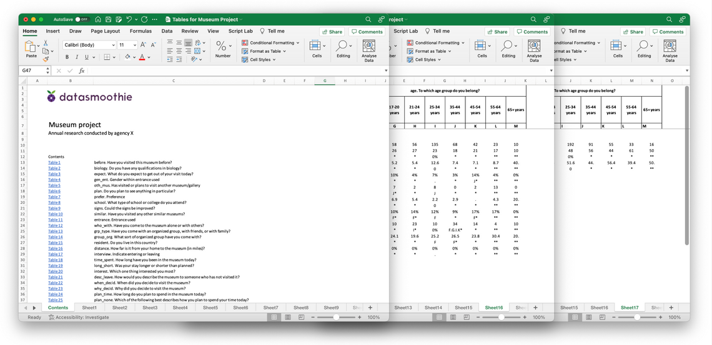

# Build Excel tables
The Tally Python SDK has a flexible feature set to build large Excel data tables and gives the user full, granular control over the content of the tables.




## The build object
Tally implements an object called `build` which represents each build of outputs. Each build has a list of sheets and each sheet has a list of tables.


If there are more than one sheets in a build, a table of contents is automatically created. A logo can also be included in the build and font familyi and font sizes can be set.

```
build = tally.Build(
    name="Sport survey", 
    subtitle="Annual research conducted by agency X",
    default_dataset=dataset,
    table_of_contents=True,
    logo='./images/datasmoothie-logo.png'
)
```

## Adding sheets and tables
Once we have created the `build`, we can add sheets and tables. Every sheet must belong to a build and every table must belong to a sheet.

```
sheet = build.add_sheet(banner='Wave')
sheet.name = 'Waves'

sheet.add_table(stub={"x":"q1"})
sheet.add_table(stub={"x":"q2"})
sheet.add_table(stub={"x":"q3"})
```

## Creating the Excel document
Once we've added our sheets and tables to the build, we can create the Excel document.

```
build.save_excel('client_results.xlsx')
```

A new file will get saved in the location your python script is located, called client_results.xlsx. 

## Adding multiple sheets
We can use a `for` loop to add multiple sheets to our build.
```
for stub in stub_vars:
    sheet = build.add_sheet(banner=banner_vars)
    sheet.name = dataset.get_variable_text(name=stub)
    sheet.add_table(stub={"x":stub})

```


## Setting build options on a build, sheet, and table level
Most data-specific and visual options can be set on a build, sheet or table level. For example, the entire build could use a certain variable for weighting, certain sheets can be tested for significance and certain tables could show descriptive statistics.

### Setting options on a build level
Options set on the build level will apply to every table in every sheet, unless otherwise specified. Sheet options override build options and table options override both.

```
build.options.set_weight('weight_a')
build.options.set_ci(['c%', 'counts'])
```
The above will weight all results with the variable `weight_a` and only show both percentages and counts in all tables.

### Setting options on a sheet level
Options can be set on a per-sheet level. If we've already set certain options on a build level, these will be overridden by sheet-level options.

```
build.options.set_stats(['mean'])
sheet1 = build.add_sheet(name="Q1 With means", banner=["locality"])
sheet1.add_table(stub={'x':'q1'})
sheet2 = build.add_sheet(name="Q1 With means and standard deviation", banner=["locality"])
sheet2.options.set_stats(['mean', 'stddev'])
sheet2.add_table(stub={'x':'q2'})
```

In the above, `sheet1` and will have mean calculations included in its tables, whereas `sheet2` will have both means and standard deviation. Every other sheet added will have mean calculated, but not standard deviation.


### Setting options on a table level
Options can also be set on a table-level, if there's only one table in a sheet that should have certain data included.

```
build.options.set_weight('weight_a')
sheet = build.add_sheet(name="Q1", banner=["locality"])
sheet.add_table(stub={'x':'q1'})
sheet.add_table(stub={'x':'q2'}, options={'weight':'weight_b'})
```
In the above, every table in the sheet will be weighted with the weight variable `weight_a` except that last one, which will be weighted with `weight_b`.


## Deciding what data to include
Tally Excel builds support all the data you would expect to be able to include, such as

- Counts
- Percentages
- Bases (weighted and unweighted)
- Significance testing
- Descriptive statistics (mean, standard deviation, etc.)

All of the above are options we send to the `crosstab` method and the options available are shown in the [API Reference for the crosstab method](https://tally.datasmoothie.com/#tag/Aggregations/operation/crosstab).

### Significance testing
Significance testing is done by adding an alpha paremeter (or significance level parameter). This is often 0.05 or 0.10. This can be done on a build, sheet or table level.

```
# build level
build.options.set_sig_test_levels(0.05)
# sheet level
build.options.set_sig_test_levels(0.05)
# table level
sheet.add_table(stub={'x':'q1', 'sig_level':[0.05]})
```


### Descriptive statistics
Descriptive statistics are added to tables with the `set_stats` options for builds and sheets, and the `stats` option for tables.

```
build.options.set_stats(['mean'])
sheet10.options.set_stats(['mean', 'stddev'])
sheet10.add_table(stub={'x':'q1', 'stats':['mean', 'stddev']})
```

Available statistics are 
 - mean: Mean,
 - min: Min,
 - max: Max,
 - median: Median,
 - var: Sample variance,
 - varcoeff: Coefficient of variation,
 - stddev: Std. dev,
 - sem: Std. err. of mean,
 - sum: Total Sum,
 - lower_q: Lower quartile,
 - upper_q: Upper quartile'