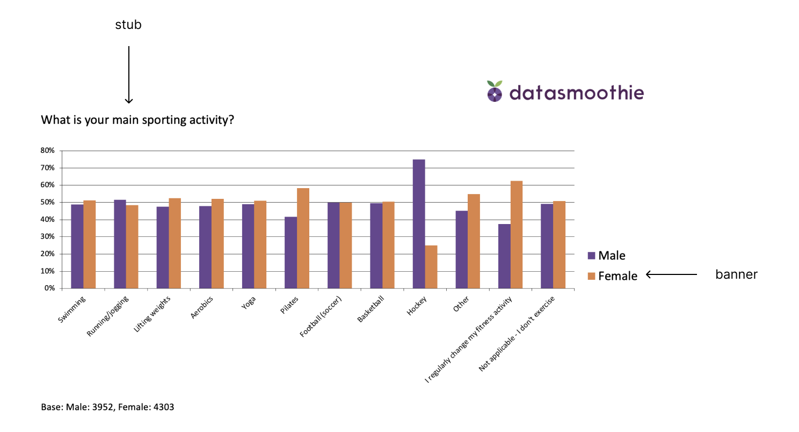

# Build PowerPoint slides
<span class="badge badge-primary">Beta version</span>

The Tally Python SDK has a flexible feature set to build PowerPoint slideshows and gives the user full, granular control over the content of the slides. The slides contain natvie Office/Excel charts, so they can be edited like any other chart created in Excel.


## The build object

We start by loading our dataset, creating a build object and add a presentation to it.

```
ds = tally.DataSet(api_key=my_token)
ds.use_spss(`tests/fixtures/Example Data (A).sav`)

build = tally.Build(name=`client A`, default_dataset=ds)

presentation = build.add_presentation(`My client`)
```
Then we decide what variables we want to add as charts and what we want to visualise in the charts, i.e. whether we want to show percentages, means, counts, etc.

```
presentation.add_slide(
    stub="q1", 
    banner="gender",
    show=`r%`,
    options={
        `chart_type`:`column_clustered`,
        `template`:1,
        `title`:`What is your main sporting activity?`
    }
)
```
Finally we save the file
```
presentation.save_powerpoint(`test.pptx`)
```

### Options for `add_slide`
We decide what our PowerPoint file is going to look like by supplying options to `add_slide`.

#### Selecting data with `stub` and `banner`
Two options indicate what data to use: `stub` and `banner`. Below, the stub is "what is your main sport" and the banner is "gender".



#### Selecting what to calculate with `show`
Using the `show` option, we can select what we want to calculate. The optoins are 

- `counts` - the counts/frequencies
- `c%` - column-wise percentage
- `r%` - row-wise percentage
- `mean`- the mean descriptive statistic

#### Setting PowerPoint specific features with `options`
Finally, use the `options` parameter to set options specific to the PowerPoint file. The available options are

- `chart_type` - what chart type to use
- `table` - show a table in the slide with the data selected (same options available as in the `show` parameter)
- `slide` - what master slide to use for this slide (defaults to 1)
- `tick_labels_font_size`, default 11
- `title`, default None
- `template`, default 1,
- `show_question_in_chart`, default False,
- `value_axis_maximum_scale`, defaults to Excel's automatic scale 
- `value_axis_minimum_scale`, defaults to Excel's automatic scale
- `data_labels`, default False,
- `data_labels_font_size`, default 9
- `data_labels_font_color`, RGB value default [0,0,0]
- `data_labels_number_format`, default None
- `data_labels_position`, default inside_end


### Supported charts

Supported chart types are:

`three_d_area`, `three_d_area_stacked`, `three_d_area_stacked_100`, `three_d_bar_clustered`, `three_d_bar_stacked`, `three_d_bar_stacked_100`, `three_d_column`, `three_d_column_clustered`, `three_d_column_stacked`, `three_d_column_stacked_100`, `three_d_line`, `three_d_pie`, `three_d_pie_exploded`, `area`, `area_stacked`, `area_stacked_100`, `bar_clustered`, `bar_of_pie`, `bar_stacked`, `bar_stacked_100`, `bubble`, `bubble_three_d_effect`, `column_clustered`, `column_stacked`, `column_stacked_100`, `cone_bar_clustered`, `cone_bar_stacked`, `cone_bar_stacked_100`, `cone_col`, `cone_col_clustered`, `cone_col_stacked`, `cone_col_stacked_100`, `cylinder_bar_clustered`, `cylinder_bar_stacked`, `cylinder_bar_stacked_100`, `cylinder_col`, `cylinder_col_clustered`, `cylinder_col_stacked`, `cylinder_col_stacked_100`, `doughnut`, `doughnut_exploded`, `line`, `line_markers`, `line_markers_stacked`, `line_markers_stacked_100`, `line_stacked`, `line_stacked_100`, `pie`, `pie_exploded`, `pie_of_pie`, `pyramid_bar_clustered`, `pyramid_bar_stacked`, `pyramid_bar_stacked_100`, `pyramid_col`, `pyramid_col_clustered`, `pyramid_col_stacked`, `pyramid_col_stacked_100`, `radar`, `radar_filled`, `radar_markers`, `stock_hlc`, `stock_ohlc`, `stock_vhlc`, `stock_vohlc`, `surface`, `surface_top_view`, `surface_top_view_wireframe`, `surface_wireframe`, `xy_scatter`, `xy_scatter_lines`, `xy_scatter_lines_no_markers`, `xy_scatter_smooth`, `xy_scatter_smooth_no_markers`